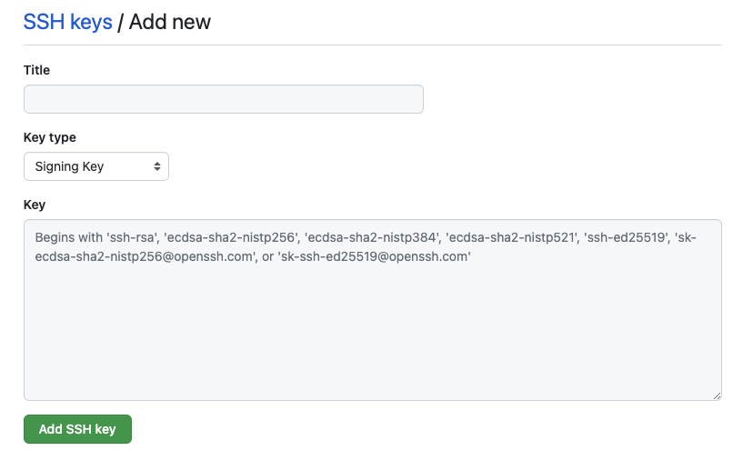

Setting up GitHub and your development environment so you can sign Git commits is simple and it means you get those nice verified badges on GitHub! More importantly, in the age of supply chain attacks and mistrust, signing commits is a great way of proving who you are and building trust for the systems you work with.

Don't panic! This is all sorts of easy when you know how. It took me three attempts to make this work from two different information sources and so I figured when I mess this up and need to re-implement the setup process, there should be a blog for that. This blog post.

*Note: This post is focussed on OSX and worked for me on Ventura*

## General Process

The general process for signing your commits with an SSH key:
* Create new spanky `ed25519` keys because GitHub are tightening their belts
* Upload that key to GitHub as a signing key not authentication key
* Create SSH config
* Create your local `git` client configuration for signing
* Ensure the email you sign with is configured in GitHub
* Test

### Create New SSH key

With your favourite terminal, create a new SSH key. I won't bother hiding my email address because I freely share it on the blog so you can make contact if you so wish.

```bash
> ssh-keygen -t ed25519 -C "me@dave.dev"
Generating public/private ed25519 key pair.
Enter file in which to save the key (/Users/dgee/.ssh/id_ed25519): 
Enter passphrase (empty for no passphrase): 
Enter same passphrase again: 
Your identification has been saved in /Users/dgee/.ssh/id_ed25519
Your public key has been saved in /Users/dgee/.ssh/id_ed25519.pub
The key fingerprint is:
SHA256:ZV4ihskZK*****************************Fb2s me@dave.dev
```

Great. Now, the next step is to upload the public key to GitHub. 

*Note that if you used a passphrase with your key creation, there will be an extra step, so don't forget it!*

### Upload Key to GitHub as Signing Key

```bash
pbcopy < ~/.ssh/id_ed25519.pub
```

Login to your GitHub account and go to __->settings->keys__ and click the __'New SSH key' button__ or just click the link below.
https://github.com/settings/ssh/new


{{}}<br/>

Next, change the key type drop down to 'Signing Key', give your key a title and paste in the contents to the Key box. The previous `pbcopy` command copied the key to your clipboard.

{{}}
<br/>

Once you've done that, hit __'Add SSH key'__.

### Create Local Git Client Config
This is where my face met a brick wall. A bit of Googling helped however.
* Add the key to your ssh-agent
* Add the passphrase to the Apple keychain *(leave it out if you didn't)*

```bash
eval "$(ssh-agent -s)"
ssh-add apple-use-keychain ~/.ssh/id_ed25519 #can be omitted

touch ~/.ssh/allowed_signers

git config --global gpg.format ssh
git config --global commit.gpgsign true
git config --global gpg.ssh.allowedSignersFile ~/.ssh/allowed_signers
git config --global user.signingkey ~/.ssh/id_ed25519.pub
```

The block above also assumes that you have a `~/.gitconfig` file in place. Mine looks like this after the steps above.

```bash
[user]
        name = David Gee
        email = me@dave.dev
        signingkey = /Users/dgee/.ssh/id_ed25519.pub
[core]
        editor = vim
[gpg]
        format = ssh
[commit]
        gpgsign = true
[gpg "ssh"]
        allowedSignersFile = /Users/dgee/.ssh/allowed_signers
```

### Create SSH Config

My `/.ssh/config` file looks like this.

```bash
Host github.com
  AddKeysToAgent yes
  IdentityFile ~/.ssh/id_ed25519
```

### Create `allowed_signers`

Now we need to populate the `allowed_signers` file you created in the block above. The pattern for that block goes `<email> <key_type> <key_id>`, so my file looks like:

```bash
> cat ~/.ssh/allowed_signers 
me@dave.dev ssh-ed25519************************************************************AAAACSl8o
```

### Test

Before testing, ensure that the email that you're using is in GitHub as a registered email adddress, else your verification status will be `unverified`, womp womp.

You can either add a test commit or create a phony project to sign a commit with. I did this to an existing repository. The `-S` flag below is for signing the commit, the `--allow-empty` will force a commit without any changes in the repo, the `--message` is a commit message string and `--signoff` will do a commit sign-off (not the same as sign). 

```bash
git commit -S --allow-empty --message="Testing SSH signing" --signoff
git log --show-signature -1
```

Hopefully you saw a signature and it's time to celebrate!

### Resources

These are some of the links I used to get setup.

- https://docs.github.com/en/authentication/connecting-to-github-with-ssh/generating-a-new-ssh-key-and-adding-it-to-the-ssh-agent
- https://calebhearth.com/sign-git-with-ssh
- https://docs.github.com/en/authentication/managing-commit-signature-verification/signing-commits
- https://git-scm.com/book/en/v2/Git-Tools-Signing-Your-Work