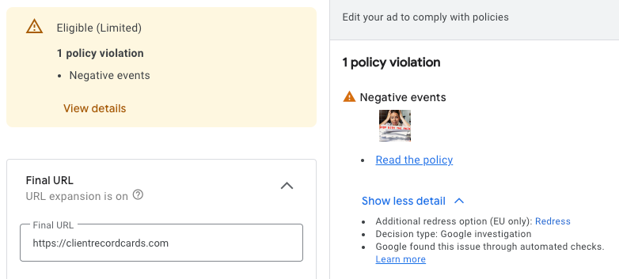
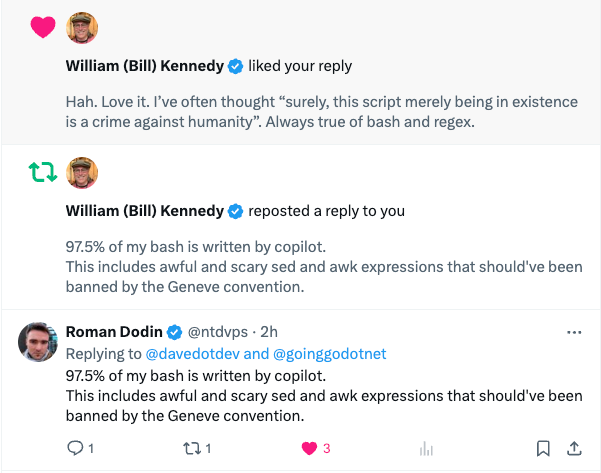

{{}} 

Yes, this title is a little click baity, but it's how I'm feeling right now. I'm a technologist at heart and I'm perhaps a little depressed about it all.

This week, [Devin](https://www.cognition-labs.com/blog?ref=built.fm) has been in the news headlines and many software engineers and developers are already questioning their work, as Orwell's 1984 Capitalist movement is in full flight, with more news surfacing of yet more outsourcing highly skilled and quite frankly, hugely important jobs like in [aeronautical engineering](https://www.bloomberg.com/news/articles/2019-06-28/boeing-s-737-max-software-outsourced-to-9-an-hour-engineers?ref=built.fm) outsourced to $9 per hour software shops. Context remains humanities last hope, or full on luddite destruction in the true sense of demanding higher quality from our capitalist captors. Context means humans currently understand something deeper that AI yet makes a mess of. Call it reading between the lines, whatever. Humans in the loop with AI platforms will render some software usable and some jobs stable until humans are finally engineered out of the loop. Grim thoughts. Like automation, the intentions of corporations is to reduce headcount and maximise profit, yet doing it under the guise of improvements to the health and career paths of employees. Classic tactics, but it's a form of evolution that has to play out.

As the world around us devolves into the cheapest way for huge organisations to hoover up the last remaining splodges of market revenue, even rudimentary common sense has gone out of the window.

## Oh not again...

My baby side gig project [ClientRecordCards.com](https://clientrecordcards.com/?ref=built.fm) is growing from word of mouth and some experimentation with Facebook ads and Google Ads. I've not ploughed tons of cash in (a few quid at this point), but the results are slowly trickling in with the user base climbing. It's a baby project, entirely bootstrapped and a year in the making, through scavenging time in the evenings and at weekends. This project is a CRM for a human driven industry, that of hair, beauty and treatments like massages, waxing and nail art.

{{}} 

This platform relies on a few upstream components and services from the behemoths of the industry, being Facebook and Google. It's no secret that automation is in play in both Facebook and Google, but the latter seems to be hyper sensitive and even with a human in the loop, remains just depressingly angering. One of my advert assets is the image below. The image was generated on Midjourney and I added the text. The pain, quite clearly is a pile of paper that's wildly out of control! The input text was good enough for Midjourney to generate a solid image, but apparently it triggered some next level corporate sensitivity BS at Google.

{{}} 

This image triggered a policy violation and has since failed two appeals. The whole point of the image is to remind people that keeping piles of paper work around with personal information is __BAD__. Two areas of the policy I suspect have been invoked. One being a depiction of a man-made crises and the other being trauma or pain. But c'mon man. Seriously? It's marketing. No one would buy anything if the world was perfect. Google builds a country toppling power house of a business selling your data and here we are with an issue that's laughable. Not only did an AI reject this, but a human in the loop didn't give so much as a reason, but just went nope.

{{}} 

 

The next issue I've had is Facebook's WhatsApp service. I send utility style messages out from the platform to users for data collection. The CRM is a utility. It's not marketing and the messages are always solicited. The messages themselves come from a platform that the user has already registered on and the messages are solicited by the fact that they wish to have a treatment or therapy that requires additional data. The message is received in accordance with the service provider and the end-user responds by providing some health data or permission to use a chemical or technique that qualified personnel deliver. Every time I update a display name or template, Facebook automatically rejects the change. I have to appeal, every darned single time. It's exhausting.

## The Slippery Slope of Silent Validation

As these matters of stupidity continue to increase and are noticeable in every day life, the two sides of the coin separate, with a vacuum of delusion separating them. On one side is a skilled employee, delivering a service for their employer and on the other side is someone using that service, buying said service from a company.

As AI is used to replace jobs or to augment them, the human skill involved diminishes to the point of being worthless, which is entirely the aim of AI businesses, but maybe not their creators. Engineers and scientists often become obsessed with making something happen and largely ignore the consequences. It's part of being human. I digress. When AI systems are used by organisations to augment the success of their products or services, human abilities around those things drop and tribal knowledge dries up. On the consumer side, when products and services are used, especially those targeted at software developers, there is an expectation that some rational person can be reached or interacted with to help use or consume those products and services. The gap in-between the two is a growing void and the hilarious bit is, if consumers cannot raise reasonable grounds to communicate with product and service owners within a business, and AI gates that ability, management reports I suspect will also be void of complaint, because the automation has masked most of the communication path. Level one tickets (if you can even find how to raise one) driven by AI will be largely hit with a hammer through lack of contextual awareness and silly policy and gating. That means escalations will increase and level two and move personnel will be involved in support and product management. Reports that include reviews on support and customer success, will probably report those increases and tie it to "product complexity" as opposed to total failure of level one business support. The irony being, if level one support, the first point of contact actually employed humans with time to learn the product and business, customer success would be much higher, but at slightly less profit. The classic automation sell was to increase revenues, but hey, no point in towing that line.

I'm already beginning to see this happen across organisations I personally and professionally deal with and have opted where I can to buy services from small businesses with the personal touch. Even a favourite coffee shop of mine recently implemented their table service application with a QR code. The team behind the counter looked genuinely shocked when being asked to place an order, with a mumbled "There is an app now". Sigh.

Small businesses should remember or learn that being small is a gift. The days of imitating large corporations to appear more professional isn't desirable or even wanted anymore.

## Future of Children
Part of growing up is having a crappy job. We've all been there. Kitchen worker at McDonalds, shelf stacker at a supermarket and even, dare I say it, paperboy! Many of these jobs are being automated out of existence and the opportunities for our children to build life skills like how to interact with people and how to resolve conflicts, are being surgically removed from society.

This year I've had to sit in a doctors surgery and wait for my wife or for an appointment. The sheer amount of appointment requests for teenagers to see a councillor shocked me. With reduced paths for our young to learn about life, this time bomb is something that genuinely concerns me.

## AI for Good
Im at a point in life now where I use AI tools everyday. I use them for image generation, for transcribing audio, for writing bits of code and scripts I can't be bothered to do or simply, don't want to do. But, I know how to do that stuff that AI does for me.

{{}} 

As we welcome the younger generation to the workforce, give them some time to learn how to do tasks manually and show them how to do them well. At which point, AI can help and speed things up. When the AI driven tool screws up or does something un-optimally , you have the skills to catch-and-correct. A skilled person augmented with AI can do wonders. A non-skilled person with AI will be finely tuned out of a job, resulting in mediocrity for society. As younglings enter the workforce, they're on lower pay. It's the perfect time to play through the history books and augment their knowledge, not let AI be the source of it. Orwell's 1984 novel is a terrifying read, but we don't have to worry about history being changed and books being burnt, because seemingly few people care about building knowledge from the history books and adding to it through life.

The assumption that technology will make the future better was great, whilst humans incrementally added to the knowledge set and thus history. Each generation that came along was expected to learn the previous skills as well as add new ones. AI when used to optimise pennies on the pound removes that learning requirement and opens the door to algorithms blindly firing employees because of statistics and share price changes. The movie [Idiocracy](https://www.imdb.com/title/tt0387808/?ref=built.fm) might give us a glimpse into our future if our course remains uncorrected.

## Hope
The number of computer science degrees undertaken is climbing, which is great. Whilst there is a thirst for knowledge, there is some hope. Higher salaries I suspect is largely the driving force behind the subject choice and I hope that humanities best bits begin to tip the tide. Philosophically one might argue that governments don't care and that we're beyond saving, but people can change the course of history over and above their governing parties.

## Grey Noise
A humorous take is that we're at peak AI training. As humans have largely contributed to the knowledge that goes into training an AI system, as soon as AI begins to dominate knowledge creation, the noise generated by those systems will ultimately be fed back into those systems, creating kind of a useless grey knowledge that looks great on paper, but en-masse is self perpetuating and full of fabricated nonsense. I'm not saying all AI is like this (this is a huge topic), but in the realm of LLMs, this is a sad truth. The non-tech, domestic world seems to have latched on to ChatGPT, and career Mums in coffee shops can be heard pontificating and navel gazing about technology, driving further the opinions of soceity. There are lots of great AI tools that help with structural and engineering components, video creation and editing, voice creation, image generation and evens security. These tools can unlock and accelerate creative industries, but I advocate for speeding up what you can already do, not entirely replacing it and shifting the value to the AI. I worry that without knowledge and careful handling of the tools at your finger tips, we're drinking cocktails on a sinking boat, worrying about the pattern on the deckchairs.

