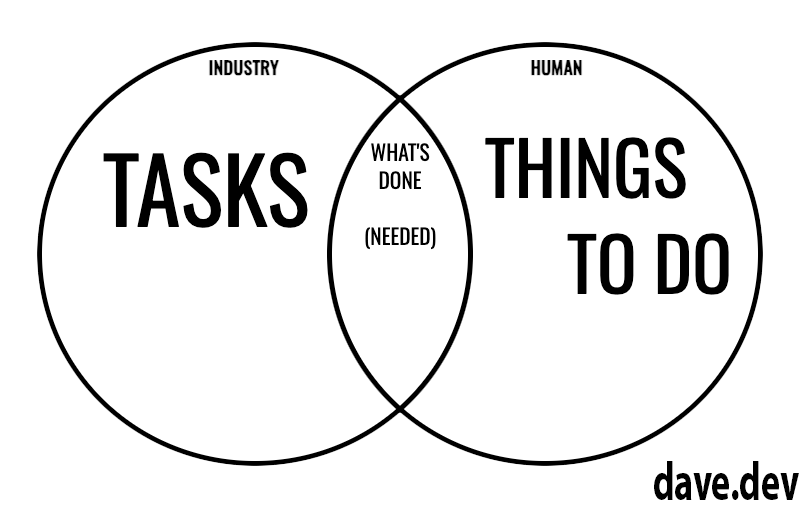

_For the reader, this post is about building micro-SaaS projects and tiny software projects that result in recurring revenue. It might be a browser extension, it might be an app, but whatever it is, it's focussed and small._

In the last two years, I've had five micro-SaaS side projects fail. In theory, they all had legs, but for whatever reason, just didn't go anywhere. One of which I regret shutting down. Other people have since taken up the same idea and ran with it, making a few thousand bucks a month. Experiencing this kind of failure hurts and making the first sale of any subscription feels so unachievable. Even worse, any new idea begins with surety and confidence that the idea is good, but out of the gates, the weight of the previous failure still hangs, delivering zero hope for a sale. This feeling leaks into your outlook, your day-to-day life, and it's as if you actually smell of failure. 

We read and hear so many stories about not over-engineering ideas, doing the bare minimum and getting the core of an idea out there for people to use. I've interviewed and chatting with so many people over the years, and it's the same message, build the narrow core after validating the idea and be pushy to get it out into the world. Without being pushy, you're doomed to fail. Even if the idea is great, with no one knowing it exists, you will get zero purchases. I can hear you screaming at the screen, but I have bad news. You are not sitting on the next billion dollar exit. The odds are in my favour to say this. Hundreds of dollars, thousands of dollars, hundreds of thousands of dollars is, however, achievable. For a few of you, it will be over a million.

### Cold Light of Day
One of my active SaaS projects hit me hard this year. It's relatively feature rich for a micro-SaaS and after some analysis, over 90% of users use less than 30% of the code base. Even better, the offering covers legal requirements for the hair and beauty industry and yet, those features go unused most days. What matters the most to the user base is initial onboarding data collection and beyond that, 1% of users collect what's required to satisfy insurers, which is both insightful and terrifying. I experienced this kind of thing in networking all the time, but it seems oddly foreign on a personal project. "How come the things you need to do aren't being done?". My cold light of day reflection of doing "what's required" vs "what **should** be done" hit home hard.

### What's Required
Get people to be honest about their needs. You know this yourself. What you need vs. what you use and how you do it have varying mileage. You'll settle for ease of use over depth of features, and it's even better if the features are implicitly used in the UX of the workflow! How this manifests is people know their work, they know their line of business, and no amount of knowledge building will come close to that experience. That's why lots of successful people recommend building something in an industry you're familiar with and work in already.

### What Should Be Done?
If we all did everything that was required of us, we wouldn't sleep. We sacrifice tasks every day in the name of efficiency, optimisation or shortness of time and on the other side of the argument is naivety in not knowing what should be done. The good news is it shouldn't be hard to find those people and sift them from the data set. Only some things out of the "what should be done" category will ever get done. Just because an industry has standards, once humans get involved, the bare minimum Venn diagram will get overlaid on top and that's where your hotspot is. If you make something in the overlap easier and high quality, then you just might make a dollar.

### Venn Of Utility
This is obvious and it bloody well should be. The thing I've learnt the hard way over the last few years is just how narrow that overlap actually is. For micro-SaaS offerings, it should be narrow as possible without putting people off. If it's wide, then you don't have a micro-SaaS or narrow product. You have a business and that will be a headache. No amount of telling yourself "you can do it" will ever stop the spare-time builder treadmill.

There's no advice here other than asking the questions you don't want to ask. Accept that humans are creatures of ease; they're safe path finders. They want easy-to-use tools that don't get in the way or make them feel like they've bought into a death sentence. This isn't easy, but if you find the overlap to be huge, then maybe trash the idea. Your idea might be entirely valid, but the business model is a poor fit.

{{}} 

If I knew then what I know now, I wouldn't have bothered with 50% of the features in my last micro project. It would be the top two things required by the industry and a conscious choice to write up the other requirements on a memo and store them so my brain can move on.

I challenge you to rip up your plan, throw those post-its in the trash, and launch what you have. Chances are you already have what's needed without even knowing it.

I'll leave you with this. My first paying customer for one of my projects was because of a bug. I tallied up 'free resources' across a customer account instead of vertically within a customer's record. That meant they hit the free limits pretty darned quickly, with no complaint email threatening to never pay. They just paid. That was an eye opener and yes, whilst I felt a little guilty, I learnt a valuable lesson. Your free tier doesn't have to be much more than convincing the customer that it works for them and the way they work. 

Good luck builders.

